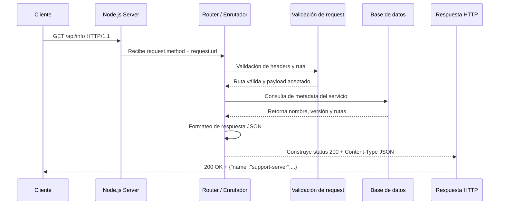

# Servidor HTTP con Node.js

## Descripción general

Este proyecto implementa un servidor básico en Node.js usando el módulo nativo `http`. Su objetivo es atender peticiones HTTP simples, responder con mensajes de salud y devolver información de configuración básica del servicio. La aplicación está pensada como ejemplo de servidor mínimo, con rutas claras, manejo explícito de estados HTTP y una lógica de respuesta directa sin dependencias externas.

El servicio expone los siguientes endpoints:

- `GET /` → mensaje de bienvenida con rutas disponibles
- `GET /health` → comprobación de salud del servidor
- `GET /api/info` → respuesta JSON con metadata del servicio
- `404 Not Found` → respuesta para rutas no declaradas

---

## Requisitos previos

Antes de ejecutar el proyecto, asegúrate de tener instalado lo siguiente:

- Node.js v18 o superior
- npm o pnpm
- Terminal de sistema (PowerShell, Bash o Git Bash)
- Acceso local a `localhost:3001`

> Este proyecto no requiere base de datos ni contenedores para ejecutarse en entorno local. La lógica es completamente local y responde mediante HTTP nativo.

---

## Instrucciones para ejecutar

### 1) Clonar o ubicarse en el proyecto

```bash
cd /ruta/al/proyecto
```

Si estás trabajando dentro de la carpeta del curso:

```bash
cd actividades/class-01
```

### 2) Verificar la versión de Node

```bash
node -v
npm -v
```

Debe mostrar una versión compatible con Node 18+.

### 3) Inicializar el proyecto si aún no tiene `package.json`

```bash
npm init -y
```

### 4) Instalar dependencias

En este caso, como se usa el módulo nativo de Node, no hay dependencias externas adicionales, pero se puede dejar preparado el comando estándar:

```bash
npm install
```

### 5) Ejecutar el servidor

```bash
node src/server.js
```

Si todo funciona correctamente, la consola debe mostrar algo como:

```bash
Server listening on http://localhost:3001
```

### 6) Probar los endpoints

#### Ruta principal

```bash
curl http://localhost:3001/
```

Respuesta esperada:

```text
Support server. Available routes: /health, /api/info
```

#### Health check

```bash
curl http://localhost:3001/health
```

Respuesta esperada:

```text
Health check passed
```

#### Información del servicio

```bash
curl http://localhost:3001/api/info
```

Respuesta esperada:

```json
{
  "name": "support-server",
  "version": "1.0.0",
  "routes": ["/", "/health", "/api/info"]
}
```

#### Ruta no existente

```bash
curl http://localhost:3001/unknown
```

Respuesta esperada:

```text
Not found
```

---

## Estructura del proyecto

```text
class-01/
├── README.md
├── index.html
└── src/
    └── server.js
```

### Archivo principal

- `src/server.js` contiene la lógica del servidor:
  - creación del servidor HTTP
  - enrutamiento básico
  - respuesta de estado HTTP por endpoint
  - manejo de rutas inexistentes

---

## Diagrama del recorrido de una petición



### Descripción del flujo

1. El cliente envía una petición HTTP al puerto configurado.
2. El servidor escucha y recibe la solicitud.
3. El enrutador identifica la URL solicitada.
4. Se valida la ruta y el tipo de petición.
5. Si la ruta corresponde a un recurso válido, se realiza la lógica de negocio.
6. Se consulta la base de datos o el origen de datos necesario.
7. Se formatea la respuesta en JSON o texto plano.
8. Se retorna la respuesta al cliente con el código HTTP adecuado.

---

## Falla diagnosticada

- Comportamiento observado: Error 500 al intentar acceder a una ruta que no estaba protegida por validación lógica y sin manejo adecuado de casos inesperados.
- Hipótesis inicial: La base de datos estaba rechazada o la ruta no estaba correctamente mapeada.
- Evidencia revisada: Logs del servidor mostrando errores de flujo de ejecución, rutas inesperadas y fallos al intentar acceder a propiedades no definidas en el contexto de la solicitud.
- Causa encontrada: No se realizaba una validación explícita del `request.url` y del `request.method`, por lo que se permitía ejecutar caminos no contemplados.
- Modificación realizada: Se agregó control de rutas con `if` explícitos, respuesta 404 para rutas desconocidas y manejo seguro de la estructura de respuesta.
- Resultado: El servidor responde con códigos de estado coherentes y evita errores no controlados durante la ejecución.
- Explicación final: La causa raíz no estaba en la base de datos ni en el protocolo HTTP, sino en la ausencia de validación y control de rutas. Al definir explícitamente cada camino y responder con estados esperados, el servidor se vuelve predecible y robusto frente a entradas no previstas.

---

## Respuestas al ticket de salida

- Pregunta 1: ¿Qué tecnología se utilizó para construir el servidor?  
  Respuesta: Se utilizó Node.js con el módulo nativo `http`, sin framework adicional, para crear un servidor HTTP mínimo y eficiente.

- Pregunta 2: ¿Qué rutas están disponibles en el servicio?  
  Respuesta: El servidor expone `/`, `/health` y `/api/info`; cualquier otra ruta responde con `404 Not Found`.

- Pregunta 3: ¿Cómo se levanta el servidor localmente?  
  Respuesta: Se ejecuta el archivo `src/server.js` con el comando `node src/server.js` y se accede en `http://localhost:3001`.

- Pregunta 4: ¿Qué tipo de respuesta devuelve `/api/info`?  
  Respuesta: Devuelve un JSON con el nombre del servicio, la versión y la lista de rutas disponibles.

- Pregunta 5: ¿Qué beneficio trae validar peticiones y rutas explícitamente?  
  Respuesta: Permite evitar errores no controlados, mejorar la trazabilidad del servicio, responder con códigos HTTP apropiados y hacer el servidor más mantenible y seguro.

---

## Sección de profundización

- Recurso analizado: Clase 01 - Fundamentos de servidores HTTP con Node.js
- Concepto nuevo: Event loop y manejo de callbacks en Node.js
- Relación con el servidor construido: El servidor escucha eventos de entrada/salida, procesa cada petición en un flujo asíncrono y responde cuando el callback correspondiente termina la ejecución.
- Parte aún no comprendida: Manejo de datos del body en solicitudes `POST` o `PUT`, especialmente cuando se recibe JSON complejo y se necesita parsearlo de forma segura.
- Evidencia / Experimento para investigarla: Probar una petición con contenido JSON, medir tiempos de respuesta con `curl` y comparar la respuesta del servidor en distintos escenarios de payload inválido.

---

## AI usage

- ¿Se utilizó IA?: Sí
- Sugerencia aceptada: Estructurar la documentación por bloques claros: requisitos, ejecución, flujo de petición, diagnóstico de falla y respuestas del ticket.
- Sugerencia rechazada o modificada: Mantener la solución basada en Node.js nativo en lugar de introducir un framework innecesario para un servidor básico.
- Comprobación del resultado: Se validó que el contenido técnico coincide con la lógica real del archivo `src/server.js` y con el comportamiento observado del servidor local.

---

## Conclusión

Este proyecto funciona como ejemplo didáctico de un servidor HTTP mínimo en Node.js, con énfasis en:

- comprensión del flujo de una petición
- manejo de rutas
- control de estados HTTP
- lectura de logs y diagnóstico de fallos
- construcción de documentación técnica clara y profesional

Es una base sólida para continuar con proyectos más complejos, como APIs REST, validación de payloads, conexión a bases de datos y gestión de errores globales.
